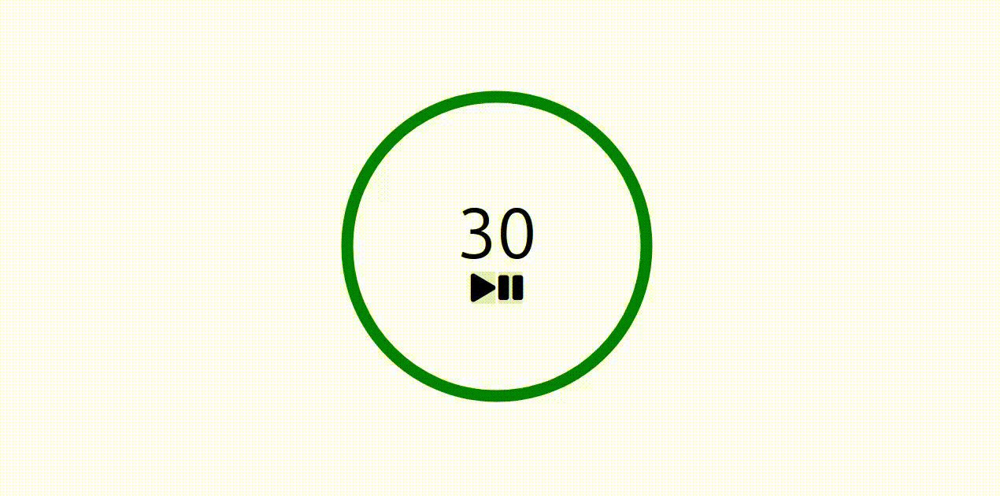

### 🎯 Objetivo do Estudo

 
 

Este projeto foi criado para colocar em prática conceitos de javascript, explorados no curso 
**The Modern Javascript Bootcamp Course** do instrutores [Colt Steele](https://www.udemy.com/user/coltsteele/) e [Stephen Grider](https://www.udemy.com/user/sgslo/) na plataforma da Udemy. O curso é todo em inglês, realizei cada aula sem a necessidade de legenda, para amplificar o meu aprendizado de outra linguagem também. 

Durante o modulo do projeto, adotei uma metodologia de aprendizado ativo durante o desenvolvimento:
* Pausei as aulas a cada desafio proposto para tentar implementar a lógica sozinho antes de ver a solução do instrutor.
* Não me limitei ao código original. Apliquei modificações pessoais e refatorei trechos para adequar ao meu estilo de codificação e para resolver problemas que identifiquei.
* Observei que havia alguns bugs na solução final, então propus as minhas próprias soluções de correção.
* Crie analogia de outras com outras áreas do conhecimento. 
* Durante algumas partes acompanhei a resolução para aprender conceitos novos. Todo conhecimento novo capturado criei "Pacotes Intermediários" (PI), seguindo a metodologia do livro **"Criando um Segundo Cérebro"** do **Tiago Forte**. Também flash card para reforçar o aprendizado dos conceitos. 


### O que o projeto faz

É um projeto de um cronometro simples. Ele já inicia por padrão com 30 segundo, mas o valor pode ser modificado. Ao clicar no botão de play, o tempo começa a decrescer e o circulo externo começa a sumir. Também é possível pausar e retomar. 

### 🛠️ Tecnologias & Ferramentas
* **Linguagem:** HTML, CSS e Javascript ES6+
* **Ambiente:** Linux e Firefox
* **Ferramentas:** VS Code e Obsidian

### 🧠 O Que Eu Aprendi (Diário de Bordo)
#### 1. Conceitos Novos
* Utilizar e manipular SVG (Scalable Vector Graphics)
* Usar classes que operaram junto com eventos 
* Usar `this` em método de classe e como a conversão do javascript, para compatibilidade com navegadores antigos, modifica o seu valor
* Usar métodos `getters` e `setters` no javascript
#### 2. Desafios e Soluções
* Adicionei a funcionalidade que não permite a edição do tempo quando está decrescendo;
* Adicionei a funcionalidade que bloquear o botão de play quando o tempo está decrescendo. Dessa forma, evitei também um bug, pois, quando o usuário clicava mais de uma vez no botão de play, o tempo decrescia mais rapidamente. 
```js
timerHasStart(){
	this.durationInput.disabled = true;
	this.startButton.disabled = true;
}

timerHasStop(){
	this.durationInput.disabled = false;
	this.startButton.disabled = false;
}
```
* Solucionei um bug que acontecia quando o tempo era pausado e retomado na sequencia. Quando isso acontecia, o circulo externo iniciava todos o seu movimento novamente, com base no valor que era passado quando o tempo era pausado. Então em vez de passar somente a duração como argumento para o evento `onStart()`, passei a enviar um objeto com a propriedade de `duration` e a propriedade `durationChange` que dizia se de fato o tempo foi de fato modificado e que o circulo externo precisava ser recalculado, para se comportar de maneira correta com o novo valor.  

```js
// No index.js
onStart(infoDuration) {

	const {duration, durationChange} = infoDuration;
	
	if(durationChange || !totalDurantion){
		totalDurantion = duration;
	}

}

// timer.js
onDurationChange = () => {
	this.timeLeft = this.timeLeft;
	this.durationChange = true; // Novo
}

start = () => {

	if(!this.onStart){
		return;
	}
	
	if(this.durationChange){ //Novo
		this.onStart({duration: this.timeLeft, durationChange:true}); //Novo
		this.durationChange = false; //Novo
	}else{ //Novo
		this.onStart({duration: this.timeLeft, durationChange:false}); // Novo
	}
	
	this.tick();
	this.intervalID = setInterval(this.tick, 20);
	this.timerHasStart();
}
```


### 🚀 Como Rodar Localmente

1. Clone o repositório.

```bash
git clone git@github.com:mateusalmeida31415/simple-timer.git
```
    
2. Abra o arquivo index.html no seu navegador.

### 🔮 Próximos Passos (Roadmap)
* [ ] Implementar com Typescript 
* [ ] Melhorar a interface visual
* [ ] Cria um link de acesso rápido de teste

